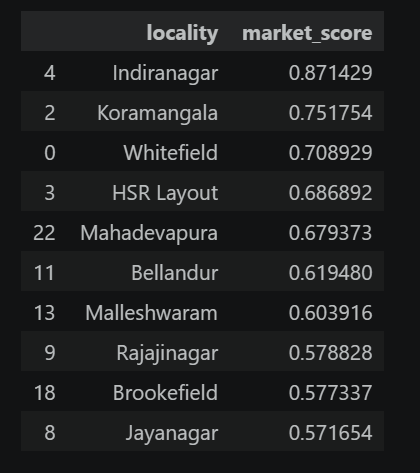
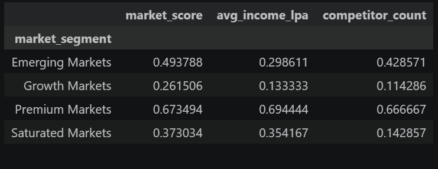
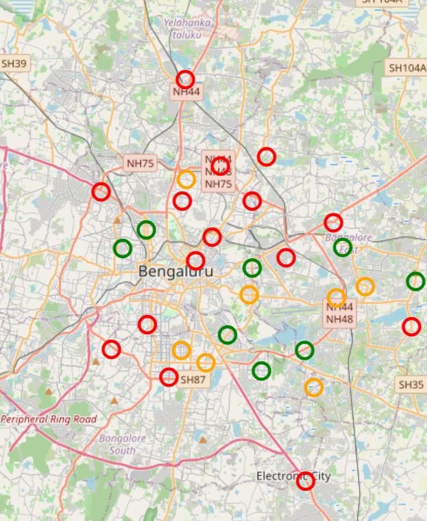

# Retail Store Expansion Strategy using Geospatial Analytics

## Overview

Retail expansion decisions require balancing market potential, accessibility, purchasing power, and competitive intensity. This project develops a data-driven location intelligence framework to identify high-potential retail expansion opportunities across Bangalore.

Using demographic, accessibility, commercial activity, and competition metrics, a Market Attractiveness Model was designed to rank localities, segment markets, and generate strategic site selection recommendations.

---

## Business Problem

A retail chain plans to expand its presence across Bangalore but faces uncertainty regarding optimal store locations.

The objective is to:

- Evaluate market attractiveness across Bangalore localities
- Identify high-potential expansion markets
- Analyze demographic and accessibility trends
- Measure competitive intensity
- Recommend strategic store locations

---

## Dataset

The analysis was conducted on 30 Bangalore localities using the following features:

| Feature | Description |
|----------|------------|
| Population Density | Population concentration within locality |
| Average Income | Estimated purchasing power |
| Metro Access | Connectivity through metro infrastructure |
| Road Connectivity | Accessibility through road networks |
| Competitor Count | Presence of major retail competitors |
| Office Hubs | Nearby commercial and employment centers |
| Commercial Score | Retail and business activity level |
| Rental Index | Relative commercial rental cost |

---

## Methodology

### 1. Exploratory Data Analysis

- Population density analysis
- Income distribution analysis
- Competitor density assessment
- Commercial activity evaluation

### 2. Market Attractiveness Framework

A weighted scoring model was developed using:

| Factor | Weight |
|----------|---------|
| Population Density | 30% |
| Income Potential | 25% |
| Accessibility | 20% |
| Commercial Activity | 10% |
| Competition Intensity | 15% |

The final Market Attractiveness Score was used to rank localities and prioritize expansion opportunities.

### 3. Market Segmentation

K-Means Clustering was applied to classify markets into:

- Premium Markets
- Growth Markets
- Emerging Markets
- Low Potential Markets

### 4. Strategic Recommendations

Localities were categorized as:

- Open Immediately
- Monitor
- Avoid

based on their market attractiveness scores.

---

## Technologies Used

- Python
- Pandas
- NumPy
- Scikit-Learn
- Matplotlib
- Folium
- Jupyter Notebook

---

## Key Visualizations

### Top Expansion Opportunities

Identifies the highest-ranked Bangalore localities based on market attractiveness.

### Market Segmentation

Visualizes market clusters based on income levels, commercial activity, and attractiveness scores.

### Interactive Expansion Map

A Folium-based interactive map highlighting recommended expansion locations across Bangalore.

---

## Key Findings

- Indiranagar, Whitefield, Koramangala, and HSR Layout emerged as the most attractive retail markets.
- Commercial corridors demonstrated significantly higher market attractiveness scores.
- Growth markets offered strong expansion potential with moderate competitive pressure.
- Emerging markets presented long-term opportunities but required further infrastructure development.

---

## Strategic Recommendations

### Immediate Expansion

- Indiranagar
- Whitefield
- Koramangala
- HSR Layout

### Medium-Term Expansion

- Bellandur
- Mahadevapura
- Hebbal
- Brookefield

### Monitor

Markets with improving commercial activity and accessibility.

### Avoid

Localities with low market attractiveness and limited commercial potential.

---

## Project Structure

```text
Retail-Store-Expansion-Strategy/
│
├── data/
│   ├── bangalore_retail_expansion_dataset.csv
│   └── bangalore_locality_coordinates.csv
│
├── notebooks/
│   ├── 01_eda.ipynb
│   ├── 02_scoring_model.ipynb
│   └── 03_clustering.ipynb
│
├── outputs/
│   ├── final_recommendations.csv
│   ├── top10_expansion_opportunities.png
│   ├── market_segmentation.png
│   └── bangalore_expansion_map.html
│
├── screenshots/
│
├── README.md
│
└── requirements.txt
```

---

## Results

The project successfully developed a scalable retail expansion framework capable of evaluating market potential and generating data-driven site selection recommendations.

The approach can be extended to:

- Other Indian cities
- Multi-store optimization
- Revenue forecasting
- Store profitability analysis
- Real estate investment strategy

---

## Resume Highlights

- Developed a retail site selection solution using demographic, accessibility, and competition-based scoring models.
- Built weighted scoring and clustering models using demographic, accessibility, and competition metrics analysis.
- Generated strategic site selection recommendations through geospatial analysis and market segmentation insights.

---

## Installation

Clone the repository:

```bash
git clone https://github.com/your-username/Retail-Store-Expansion-Strategy.git
cd Retail-Store-Expansion-Strategy

```bash
pip install -r requirements.txt

```bash
jupyter notebook

## Project Screenshots

### Top Expansion Opportunities


### Market Segmentation


### Bangalore Expansion Map

